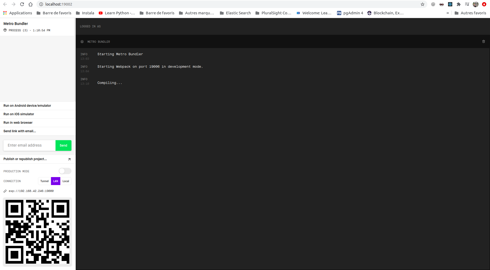

# Countdown_ToDoList_React_App
This is a native react app, to add ToDo tasks (with a starting date) to a ToDoList. Once added, a countdown will be binded and displayed to this new task, to notify the user about the approaching starting date

## Configure your enviroment:
1. install the `create-react-native-app` command, that we are going to use to initiate the react-native project:
```
npm i -g create-react-native-app
```

2. install the `expo-cli`, that we are going to use to run this project locally and on a mobile device:
```
npm i -g expo-cli
```

3. create an account on [expo website](https://expo.io/) and connect to that same account on both your PC & smartphone

## Initiate the project:

1. Once the enviroment is well setup, run the already installed `create-react-native-app` command to initiate the react-native project named `countdown`:
```
create-react-native-app countdown
```
## How to run this project:
1. To run this project, you can use the `expo-cli` command:
```
cd countdown
expo start
```
The project is running on :   http://localhost:19006/


**Why do we run the project using `expo` command ?**
- This command will open th UI of **expo** on your computer on http://localhost:19002/



  - From this UI, we can click the button **run in web browser** to display our project on the web browser of our computer, locally on :
  http://localhost:19006/
  - Also, from this same UI, we can scan the QR code, using our smartphone, and thus, we wil have th project running on our smartphone as well.
  - And, another advantage, we can run the debugger here:
http://localhost:19000/debugger-ui/