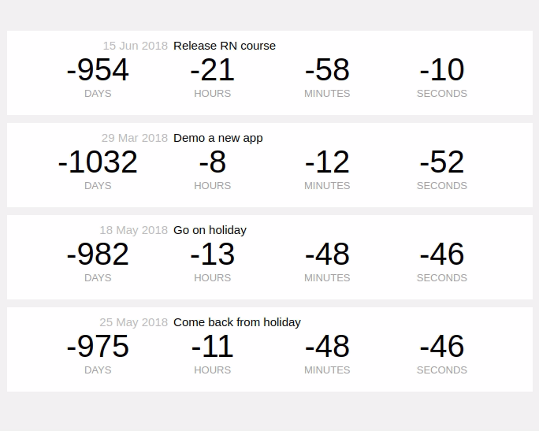

# Architecture:
- The main parent component for this project is **App Component**, which it the direct parent of the child Component **EventList**.
- The **EventList** component is meant to gather and display a list of event (a ToDo list). So, it should contains within itself, another child component for each event: the child component **EventCard**.
- Therefore: the **App** is the parent component of **EventList** component and, this last is the parent component of the **EventCard** component.

# EventList Component:
## Create the EventList Component and use it:
- This is a class component, that is used to display the **list** of events, like this :


- First, create our first component **EventList** and then render it in the **App** main component :
    1. Declare/Define a class component "EventList" & export it (so that we can use it in other components in the project) :
    ```typescript
    export default class EventList extends Component {}
    ```

    2. Add a **render()** method in this "EventList" component and add jsx code inside it (to display the list of Event). Since we need to display a list, we are going to use/return a Native React Component called **FlatList** (follow the FlatList explanation below), in the render method:

    ```typescript
    export default class EventList extends Component {
        render() {
            return (
      // The FlatList should pass the event data to the child component EventCard
            <FlatList
                style={styles.list}
                data={this.state.events}
                renderItem={({ item }) => <EventCard event={item} />}
                keyExtractor={(item) => item.id}
            />
            );
        }
    }
    ```

    3. Then, call the **EventList** class component in its parent component **App**:
    ```typescript
    export default class App extends React.Component {
        render() {
            return (
                <EventList/>
            );
        }
    }
    ```
## Use the **FlatList** element in the EventList Component : [documentation](https://reactnative.dev/docs/flatlist)
### Definition of FlatList element:
- To use a FlatList, you need to specify at least 3 properties: **data**, **renderItem** and **keyExtractor**:
    ```javascript
        <FlatList
                data={[{name: 'a', id: '1'}, {name: 'b', id: '2'}]}
                renderItem={({item}) => <Text>{item.name}</Text>}
                keyExtractor={item => item.id}
        />
    ```

    - **data** property: where we should insert the data that we want to render/iterate inside our list. The data should be parsed to in array containing the objects that you want to bind to :
    ```
    data = { [ {obj1}, {obj2}, {obj3} ] }
    ```

    - **renderItem** property: where we define the action(s) to apply on each item on our data list. The function (arrow function) defined in the **renderItem** will be called/applied on each item present on the array of **data**. And the json returned by this function will be displayed finally on the list (on the screen). In the example below, for each item (in the data array), we want to return a Text elemnt, in which we want to display the attribute `name` of this item.
    ```
    renderItem={({item}) => <Text>{item.name}</Text>}
    ```

    - **keyExtract**: where we provide a way for flatList to come up with unique key for each item to be rendered (the key should be a unique attribute/property from the data that we bind into the **data** prop of FlatList):
    ```
    keyExtractor={item => item.id}
    ```
### Binding a real data to the FlatList element:
- Add a json file with dumb data (`db.json` file in our case), that contains an object `events`. This last is an array of event objects:

```json
{
    "events": [
      {
        "title": "Release RN course",
        "date": "2018-06-15T00:00:00.000Z",
        "id": "05dafc66-bd91-43a0-a752-4dc40f039144"
      },
      ...
    ]
  }
```
- Now, to bind the data from the json file to the **EventList** component, we need to :
  - set a default state (events = empty array) in the **EventList** component to initialize a param to store this data, in our component:
  ```typescript
    // Initialize the events variable with an empty array
  state = {
    events: [],
  };
  ```
    - use a lifecycle method [**componentDidMount()**](https://reactjs.org/docs/react-component.html#componentdidmount) to bind the data (from outside the component) to the local state (events = data parsed from json or recovered from server).
    
    This lifecycle method is invoked immediately after a component is mounted (inserted into the tree). Initialization that requires DOM nodes should go here. If you need to load data from a remote endpoint (or a json file like in our case), this is a good place to instantiate the network request.

    You may call setState() immediately in componentDidMount(). It will trigger an extra rendering, but it will happen before the browser updates the screen. This guarantees that even though the render() will be called twice in this case, the user won’t see the intermediate state:
    ```javascript
        componentDidMount() {
            const events= require('./db.json').events;
            this.setState({events});
        } 
        
    ```
    In the example above, we update the state of the local parameter `events` so as to bind it with the recovered & parsed data.
    
    setState() enqueues changes to the component state and tells React that this component and its children need to be re-rendered with the updated state. This is the primary method you use to update the user interface in response to event handlers and server responses.

    In our example :
    ```typescript
    // parse the data from a json file and store it in a variable
    const events= require('./db.json').events;

    // update the local state of the "events" using the value of this variable inside the setState() method:
    this.setState({events});
    ```

    - update/adapt the render() method, to use this binded state (binded to a real data) :

    ```javascript
    <FlatList
            data={this.state.events}
            renderItem={({item}) => <Text>{item.title}</Text>}
            keyExtractor={item => item.id}
    />
    ```

# EventCard Component:
 
- This component is going to be a **function component** that represents one event element on the EventList component.
- To declare/define it as function component and export it, we use this signature :
```typescript
export default function EventCard() {}
```
## Passing Data from a Parent to a Child Component
- The data (the list of events) are read/parsed and stored in the parent comp **EventList**. We need then, to pass the data for each event to the child comp **EventCard** (which can hold the data of one **event** at a time: event is an object that has 3 attributes (name, id, date)).
  - First, define the prop **event**, in the child comp **EventCard** signature like this:
  ```typescript
  export default function EventCard({ event }) {}

  ```
  - Then, (in the parent comp **EventList**) pass the data to this prop :
  
```typescript
  export default class EventList extends Component {
    ......
    render() {
    return (
      // The FlatList should pass the event data to the child component EventCard
      <FlatList
        style={styles.list}
        data={this.state.events}
        renderItem={({ item }) => <EventCard event={item} />}
        keyExtractor={(item) => item.id}
      />
    );
  }
 }
``` 
## Using setInterval()

- In order to make these events (represented by **EventCard**) actually counting down in time, we need to use a `setInterval()` method inside the parent comp **EventList**.

- Definition: Using `setInterval()` inside React components allows us to execute a function or some code after specific intervals of time, as specified through the second parameter.

- Applying the setInterval to render every **EventCard** after an interval of **1000ms**:
  - Inside of this interval of **1000ms**, we call `setState`, and we say that we want events on state to be overridden : this new value of events (the overridden events array) we get by mapping over the existing events: for each new event, we just return a new object, that gathered each attribute currently available on the event, but with an additional attribute on it called **timer** (that we set to the result of calling Date.now()). 
  > this.setState({
        events: this.state.events.map((evt) => ({
          ...evt,
          timer: Date.now(),
        })),
      });
  - Why do we add this new attribute **timer**: we won't use this attribute in the **EventCard** comp, but still we want this value to update every second, and we want it to update for each event (that's why we set the 2nd parameter of `setInterval` to 1 sec). The reason why we do this is if we head on over to EventCard, we've got a functional component. So if none of its props change, how does it know that it needs to rerender? That's why we're setting a prop, which we don't really care about, on it just so that it can figure out that oh, my prop's changed, I've now got a new event and it's different, so I need to rerender.

```typescript
  setInterval(() => {
      this.setState({
        events: this.state.events.map((evt) => ({
          ...evt,
          timer: Date.now(),
        })),
      });
  }, 1000);
```
## TypeChecking using PropTypes

- To run typechecking on the props for a component, you can assign the special **propTypes** property:

```typescript
export default function EventCard({ event }) {
  ...
}

EventCard.propTypes = {
  event: PropTypes.shape({
    title: PropTypes.string.isRequired,
    date: PropTypes.instanceOf(Date)
  }),
};
```
- **PropTypes** exports a range of validators that can be used to make sure the data you receive is valid. When an invalid value is provided for a prop, a warning will be shown in the JavaScript console. For performance reasons, propTypes is only checked in development mode. 
In this example, we’re using :
  - PropTypes.shape({...}): to declare an object taking on a particular shape (by shape, we mean the attributes of this pbject).
  - For the attributes of this **EventCard** object (`title`, `date`), we are using respectively :
  **PropTypes.string.isRequired** (to declare a required value of a `string` data type) and **PropTypes.instanceOf(Date)** (to declare that a prop `date` is an instance of a class `Date`. This uses JS's instanceof operator)

## Styling a Component

To add some style for a component, follow these steps:

- First, create a constant (named styles for example) and call the `StyleSheet.create` and pass an object to it (the object is the style rules sheet). The object passed to the method `StyleSheet.create` is the style properties that we want to use for our component (in the example blow we have two properties : red and date). 
In this property (red or date), we pass it an object of rules (color, font-size, padding..):

```typescript
const styles = StyleSheet.create({
  red: {
    color: 'red'
  },
  date: {
    fontWeight: '200',
    fontSize: 15,
    color: '#bdbdbd',
    width: '30%',
    textAlign: 'right',
  }
})
```
- Second step: one we created the styles object, we can reference it (by calling one of his specific rules, for example: `styles.red`) inside the `style` prop of the JSX element (for example the element `<Text style={styles.red}>`):

```typescript
export default class SimpleStyleComponent extends Component {
render() {
return (
<Text style={styles.red}>Red rulz!</Text>
);
}
}
```

- Some css notes about [flex-box](https://www.w3.org/TR/css-flexbox-1/): 

There is a difference in the use of `flexbox` between **React** with **HTML**:
  -  To declare an element as a flexbox, in HTML: 
  > { display: flex }

  - To declare an element as flexbox in React:
  > { flex: 1 }

Using flexbox in React: to declare an element as `flexbox`, you need just to add the rule `flex` and give it the value `1`. 
More details:
  - `flexDirection`: this property specifies how **flex items** are placed in the **flex container**, by setting the direction of the flex container’s main axis.
  - `justifyContent` : this property aligns flex items along the main axis of the current line of the flex container. (the value `space-between` means that the flex items are evenly distributed in the line).

```css
  counterContainer: {
    flex: 1,
    flexDirection: 'row',
    justifyContent: 'space-between',
    paddingLeft: '5%',
    paddingRight: '5%',
  },
```