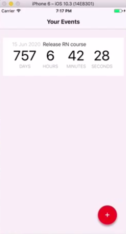

# Purposes of this Module:

In this module, we'll learn how to add some navigation to our app to navigate from one screen to another :
- First, Changing the app structure for multiple views (we will add a new component **EventForm** (to do the Navigation from the EventList Screen to the EventForm and back to the EventList)).

- Second, once the second Screen of the EventForm is ready, we'll learn :
  - how to configure the StackNavigator with these two components (StackNavigator is one of the navigation options available in React Navigation).
  - how to trigger navigation between the two screens


# Configuring StackNavigator :

First, install the react-navigation package:
> npm install react-navigation

- The simplest configuration when working with React Navigation:
  - We create an instance of `StackNavigator`, passing in a configuration object. 
  - This configuration object is keyed by the identifies for each navigation state (`list` and `form`), and each of these keys get a configuration object.
  - The most important configuration option is the `screen`, wher we specify the actual React component to display for that navigation state.

```typescript
import { StackNavigator } from 'react-navigation';

const App = StackNavigator({
    list: { 
        screen: EventList,
        navigationOptions: () => ({
            title: 'Your Events'
        })
     },
    form: { 
        screen: EventForm, 
        navigationOptions: () => ({
            title: 'Add an Event'
        })
    },
});
```

# Triggering the navigation between EventList and EventForm:
- To trigger the navigation state, we add a button onto our **EventList** that will trigger a navigation change to the **EventForm**.


- Any component that gets displayed in your navigator will receive an additional prop called `navigation`. 
On this navigation object, you can call the navigate function and give it the key of the navigation state that you want to display. 
> this.props.navigation.navigate('name-of-the-screen')


- To implement the navigation, we will start with the **EventList** where we are going to add a new button, which, when the user clicks it, will trigger a navigation change to display the **EventForm** :

  - Add an ActionButton, make it self-closing, and add two attribute to the button element: 
    - `key` onto this. Because we're returning multiple objects from this render, all these objects need to have a key. 
    - `onPress` and point it to a method called `this.handleAddEvent`. 
    - then add a `buttonColor` prop, to set a red color to our red floating ActionButton. 

```typescript
      <ActionButton
      key="fab"
      onPress={this.handleAddEvent}
      buttonColor="rgb(231, 76, 60, 1)"/>
```

   - Add the functionality that allows the navigation to the form. We create a new method on this component called a **handleAddEvent**. And in here, we go and get the **navigation** object from props, and we go and call the **navigate** function on it, passing in **form** as the key for the navigation state that we want to navigate to : 
```typescript
handleAddEvent = () => {
	this.props.navigation.navigate('form')
}
```


- Now let's go and do the same for the **EventForm** component: 
  - Add a **TouchHighlight** button, in which we bind the **press** action with a method **handleAddPress**.
  ```typescript
  <TouchableHighlight  
                    onPress={this.handleAddPress}
  >
  ```
  - In the **handleAddPress** method, we go and call **navigate** on the **navigation** object that we get there on props, and we specify that we want to navigate to **list**. 
  ```typescript
  handleAddPress = () => {
        this.props.navigation.navigate('list')
    }
  ```  
  
